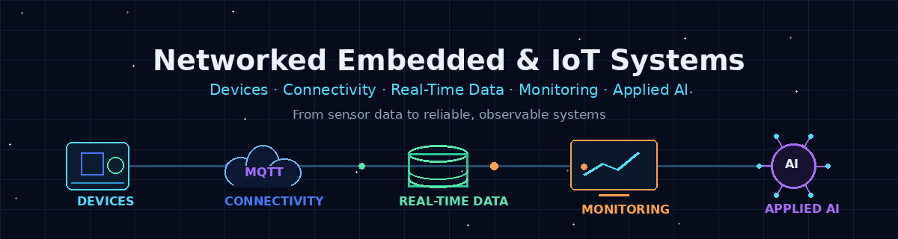

  

# Amirhossein Sadeghi

### Embedded Systems · IoT · Computer Networks · Real-Time Monitoring

Computer Engineering student working on networked devices, sensor data, telemetry pipelines, reliable monitoring, and applied machine learning.

  
  
  
  
  

  
  
  
  
  

---

## About

I am a Computer Engineering student at Isfahan University of Technology.

My **primary focus is networked embedded and IoT systems**. I work on projects that connect microcontrollers, sensors, communication modules, computer networks, user interfaces, and monitoring software into testable end-to-end systems.

I use applied machine learning, sensor fusion, estimation, and control as supporting areas where they add practical value to sensing, monitoring, reliability, and decision-making.

I try to support project claims with working code, hardware tests, logs, datasets, plots, metrics, or reproducible experiments. Limitations and unfinished parts are documented rather than hidden.

---

## Portfolio Direction

    Devices and Sensors
            ↓
    Embedded Systems
            ↓
    Communication and Connected Infrastructure
            ↓
    Monitoring, Estimation, Control, and Applied Intelligence

### Focused Track Entry Points

| Track | Start here |
| --- | --- |
| **Embedded Systems & IoT — primary** | Featured projects below |
| **Control, Estimation & Autonomous Systems** | [Focused portfolio](CONTROL_ESTIMATION_PORTFOLIO.md) |
| **Computer Networks & Networked Systems** | [Focused portfolio](NETWORKING_PORTFOLIO.md) |
| **Applied AI & Machine Learning** | [Selected AI/ML work](#applied-ai-and-machine-learning) |

---

## Featured Projects

| Project | What I worked on |
| --- | --- |
| [Cellular DTMF Control](https://github.com/amirhossein-sadeghi2003/cellular-dtmf-control) | STM32F407 and SIM800C cellular communication, hardware-validated call/DTMF work, embedded HMI development, and modem/network diagnostics |
| [IoT Digital Twin ML Pipeline](https://github.com/amirhossein-sadeghi2003/IoT-DigitalTwin-ML-Pipeline) | ESP32 telemetry, MQTT communication, Node-RED monitoring, and ML-based sensor analysis |
| [TinyML Embedded Condition Monitor](https://github.com/amirhossein-sadeghi2003/tinyml-flight-condition-monitor) | ESP32 sensor monitoring, real data collection, embedded inference, and local visual and audible alerts |
| [Embedded IMU Attitude Estimation](https://github.com/amirhossein-sadeghi2003/embedded-imu-attitude-estimation) | MPU6050 calibration, ESP32 firmware, complementary filtering, high-rate logging, OLED output, and hardware testing |
| [Ball and Beam Hardware Control](https://github.com/amirhossein-sadeghi2003/ball-and-beam-hardware-control) | ESP32-based sensing, servo actuation, feedback-control experiments, and documented hardware-prototype testing |
| [Network Lab Final Project](https://github.com/amirhossein-sadeghi2003/network-lab-final-project) | VLANs, dynamic routing, redistribution, ACLs, NAT, DHCP, HSRP, and network verification in Packet Tracer |

---

## Selected Supporting Work

### Applied AI and Machine Learning

* [Secure IoT Sensor Anomaly Detection](https://github.com/amirhossein-sadeghi2003/secure-iot-sensor-anomaly-detection)
* [Time-Series Motor Fault Detection](https://github.com/amirhossein-sadeghi2003/time-series-motor-fault-detection)
* [Battery Health Forecasting Baselines](https://github.com/amirhossein-sadeghi2003/battery-health-forecasting-baselines)
* [Industrial Surface Defect Classification](https://github.com/amirhossein-sadeghi2003/industrial-surface-defect-classification)

### Estimation, Control, and Autonomous Systems

* **[Focused Control & Estimation portfolio](CONTROL_ESTIMATION_PORTFOLIO.md)**
* [Adaptive Mobile Navigation Fusion](https://github.com/amirhossein-sadeghi2003/adaptive-mobile-navigation-fusion)
* [Embedded IMU Attitude Estimation](https://github.com/amirhossein-sadeghi2003/embedded-imu-attitude-estimation)
* [Ball-and-Beam Hardware Control](https://github.com/amirhossein-sadeghi2003/ball-and-beam-hardware-control)
* [Sensor Fusion State Estimation](https://github.com/amirhossein-sadeghi2003/sensor-fusion-state-estimation)
* [Evolutionary Control Tuning](https://github.com/amirhossein-sadeghi2003/evolutionary-control-tuning)

### Networks and Connected Systems

* **[Focused Networking portfolio](NETWORKING_PORTFOLIO.md)**
* [Network Lab Final Project](https://github.com/amirhossein-sadeghi2003/network-lab-final-project)
* [IoT Facility Network Monitoring](https://github.com/amirhossein-sadeghi2003/iot-facility-network-monitoring)
* [Networking & SDN Coursework Index](https://github.com/amirhossein-sadeghi2003/undergraduate-coursework-archive/blob/main/NETWORKING_AND_SDN.md)

### Academic Coursework

* [Undergraduate Coursework Archive](https://github.com/amirhossein-sadeghi2003/undergraduate-coursework-archive) — selected B.Sc. projects in algorithms, software, databases, operating systems, FPGA/embedded systems, computer networks, and network security

---

## Technical Areas

* STM32 and ESP32 firmware, sensor integration, and hardware bring-up;
* UART, SPI, I2C, GPIO, keypad input, TFT/OLED interfaces, and embedded HMI development;
* cellular/GSM communication, MQTT telemetry, Node-RED dashboards, and IoT data pipelines;
* routing, switching, VLANs, ACLs, NAT, DHCP, redundancy, SDN, and network verification;
* applied AI/ML for anomaly detection, fault classification, condition monitoring, and embedded inference;
* filtering, sensor fusion, state estimation, control, path planning, and signal analysis;
* Python, C, C++, SQL, Verilog, Linux/Bash, Git/GitHub, pandas, scikit-learn, and PyTorch.

---

**Primary focus: networked embedded and IoT systems — extended with estimation, control, and applied intelligence.**

