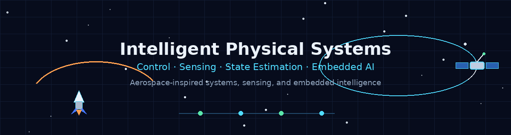

<p align="center">
  
</p>

<div align="center">

# Amirhossein Sadeghi

### Embedded Sensing · State Estimation · Planning · Control for Intelligent Physical Systems

Computer Engineering student building hands-on projects where software interacts with physical systems through sensors, models, estimation, planning, control, and applied machine learning.

</div>

<p align="center">
  
  
  
  
  
</p>

<p align="center">
  
  
  
  
</p>

---

## About

I am a Computer Engineering student at Isfahan University of Technology, developing a project portfolio around **intelligent physical systems**.

My work focuses on systems that combine:

- sensing and embedded software
- dynamic-system modeling
- state estimation and filtering
- planning and search algorithms
- feedback control and optimization
- applied machine learning for monitoring, diagnosis, and inspection
- secure IoT and cyber-physical anomaly detection

My long-term direction is close to robotics, autonomous systems, cyber-physical systems, and aerospace-inspired engineering: software that helps machines sense, estimate, decide, and act in the physical world.

---

## Portfolio Direction

The main theme of my portfolio is:

```text
Sensing → Estimation → Planning → Control → Embedded Intelligence → Secure Monitoring
```

I try to build projects that include more than source code: simulations, hardware tests, sensor data, plots, animations, model evaluation, engineering limitations, and reproducible results.

---

## Featured Projects

| Project | Area | What it demonstrates |
|---|---|---|
| [Ball and Beam Hardware Control](https://github.com/amirhossein-sadeghi2003/ball-and-beam-hardware-control) | Embedded control | ESP32, HC-SR04 distance sensing, MG946R servo actuation, open-loop tests, P-control Prototype V1, hardware debugging, demo video |
| [Embedded IMU Attitude Estimation](https://github.com/amirhossein-sadeghi2003/embedded-imu-attitude-estimation) | Embedded estimation | ESP32 + MPU6050 roll/pitch estimation, complementary filter, OLED display, LED feedback, attitude animation |
| [Sensor Fusion State Estimation](https://github.com/amirhossein-sadeghi2003/sensor-fusion-state-estimation) | Kalman filtering | 2D trajectory estimation with noisy GPS-like measurements, IMU-like acceleration, dropout handling, tracking animation |
| [Evolutionary Control Tuning](https://github.com/amirhossein-sadeghi2003/evolutionary-control-tuning) | Optimization and control | Genetic Algorithm PID tuning for a ball-and-beam simulation, fitness evolution, baseline vs evolved controller comparison |
| [Robot Path Planning Visualizer](https://github.com/amirhossein-sadeghi2003/robot-path-planning-visualizer) | Robotics planning | BFS, Dijkstra, Greedy Best-First, A*, Weighted A*, animated search visualizations, weighted-cost comparison |
| [TinyML Flight Condition Monitor](https://github.com/amirhossein-sadeghi2003/tinyml-flight-condition-monitor) | Embedded AI | ESP32-based monitoring, real sensor data, TinyML-style inference, OLED/NeoPixel/buzzer feedback, live monitor dashboard |

---

## Supporting Projects

### Dynamics, Control, and Estimation Foundations

- [DC Motor Simulation](https://github.com/amirhossein-sadeghi2003/dc-motor-simulation)
- [Mass-Spring-Damper Simulation](https://github.com/amirhossein-sadeghi2003/mass-spring-damper-simulation)
- [Kalman Filter DC Motor](https://github.com/amirhossein-sadeghi2003/kalman-filter-dc-motor)
- [Dynamic System Classification](https://github.com/amirhossein-sadeghi2003/dynamic-system-classification)
- [Ball and Beam Control Simulation](https://github.com/amirhossein-sadeghi2003/ball-and-beam-control-simulation)

### Applied Machine Learning for Physical Systems

- [Time-Series Motor Fault Detection](https://github.com/amirhossein-sadeghi2003/time-series-motor-fault-detection)
- [Industrial Surface Defect Classification](https://github.com/amirhossein-sadeghi2003/industrial-surface-defect-classification)

### IoT and System Integration

- [IoT Digital Twin ML Pipeline](https://github.com/amirhossein-sadeghi2003/IoT-DigitalTwin-ML-Pipeline)

### Security for IoT and Cyber-Physical Systems

- [Secure IoT Sensor Anomaly Detection](https://github.com/amirhossein-sadeghi2003/secure-iot-sensor-anomaly-detection)

### Additional CS / ML Coursework

- [Graph Mining Node Classification](https://github.com/amirhossein-sadeghi2003/graph-mining-node-classification)

---

## Project Map

```text
Sensing and Embedded Estimation
├── Embedded IMU Attitude Estimation
├── TinyML Flight Condition Monitor
└── IoT Digital Twin ML Pipeline

Planning and Decision-Making
└── Robot Path Planning Visualizer

Dynamics, Control, and Optimization
├── Ball and Beam Hardware Control
├── Evolutionary Control Tuning
├── DC Motor Simulation
└── Mass-Spring-Damper Simulation

State Estimation and Filtering
├── Sensor Fusion State Estimation
└── Kalman Filter DC Motor

Applied ML for Physical Systems
├── Time-Series Motor Fault Detection
├── Industrial Surface Defect Classification
└── Dynamic System Classification

Security for IoT and Cyber-Physical Systems
└── Secure IoT Sensor Anomaly Detection
```

---

## Technical Areas

- Python, C/C++, Arduino, ESP32
- NumPy, pandas, matplotlib
- scikit-learn, PyTorch
- embedded sensing and hardware bring-up
- Kalman filtering and sensor fusion
- dynamic-system simulation and response analysis
- path planning and search algorithms
- feedback control and optimization
- signal processing and feature extraction
- IoT communication and MQTT
- IoT security and anomaly detection
- computer vision for visual inspection

---

## Current Focus

I am currently strengthening my portfolio toward graduate studies in:

- robotics and autonomous systems
- control systems
- cyber-physical systems
- embedded intelligence
- sensing and state estimation
- applied machine learning for physical systems
- secure IoT and cyber-physical systems

---

<div align="center">

**Engineering software for systems that sense, estimate, plan, and act.**

</div>
